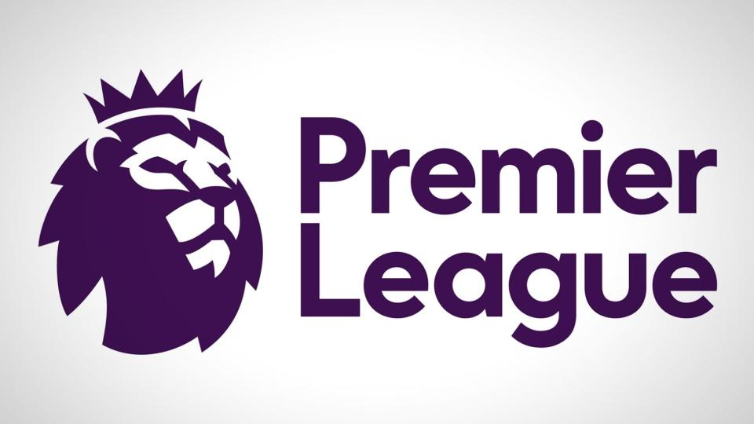

# Premier League 2024 Performance Analysis

## Overview
This project provides a data-driven analysis of football team performances over a season. The dataset includes details on goals scored, goals conceded, wins, losses, draws, points, goal difference and rank. The analysis aims to uncover patterns and insights using the CRISP-DM methodology. Visualizations are created to highlight key insights, which are deployed on social media platforms like Twitter, Facebook and Instagram.

## Dataset
The dataset contains the following columns:
- `team`: Name of the football team.
- `goals_scored`: Total goals scored by the team.
- `goals_conceded`: Total goals conceded by the team.
- `wins`: Total number of matches won.
- `draws`: Total number of matches drawn.
- `losses`: Total number of matches lost.
- `points`: Total points earned by the team.
- `goal_difference`: Difference between goals scored and goals conceded.
- `rank`: Final rank in the league standings.

The dataset includes **24 teams** and their respective statistics from the season.

## Exploratory Data Analysis (EDA)
The analysis focused on the following metrics:
- **Points**: Highlighted top and bottom teams.
- **Goal Difference**: Analyzed the correlation between goal difference and final ranking.
- **Wins, Draws, Losses**: Examined team consistency and stability.
- **Goals Scored and Conceded**: Identified offensive and defensive capabilities of teams.

## Key Insights
1. **Top Teams Dominated**: Manchester City earned the most points (177) with a goal difference of +113, reflecting their dominance.
2. **Goal Difference Correlates with Rank**: Teams with high goal differences (e.g., Manchester City, Liverpool) ranked higher, while negative goal differences (e.g., Sheffield United) indicated poor performance.
3. **Defensive Struggles for Bottom Teams**: Teams like Sheffield United and West Bromwich Albion conceded over 100 goals, contributing to their low ranks.

## Visualizations
The project includes the following visualizations:
1. **Bar Plot**: Top 5 teams by points.
2. **Scatter Plot**: Goal difference vs. rank, highlighting outliers.
3. **Bar Plot**: Wins, draws, and losses for each team.
